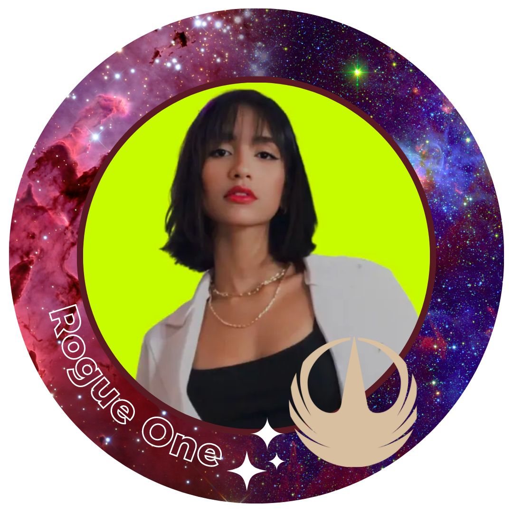

<h1 style="text-align: center;">💊 Frontend - Dashboard Farmácia 💊</h1>

## Sumário

- [Sobre o projeto](#sobre-o-projeto)
- [Tecnologias Utilizadas](#tecnologias-utilizadas)
- [Funcionalidades](#funcionalidades)
- [Como iniciar o projeto?](#como-iniciar-o-projeto)
  - [Pré-requisitos](#pré-requisitos)
  - [Instalação](#instalação)
- [Autores](#autores)

## Sobre o projeto

Nosso projeto consiste no desenvolvimento de um frontend em React.js para um dashboard no setor farmacêutico. O objetivo principal do sistema é oferecer uma interface intuitiva e eficiente para auxiliar no gerenciamento das atividades diárias de uma farmácia.

## Tecnologias Utilizadas

O projeto foi desenvolvido utilizando as seguintes tecnologias:<br>
<br>
<br>
<br>
<br>
<br>
<br>
<br>
<br>

<details>
<summary>Mais informações das tecnologias</summary>

- [TypeScript](https://www.typescriptlang.org/): uma linguagem de programação que adiciona recursos de tipagem estática ao JavaScript.
- [React](https://pt-br.react.dev/): React é uma biblioteca JavaScript de código aberto desenvolvida pelo Facebook que permite criar interfaces de usuário interativas e responsivas para aplicativos da web.
- [Chart js](https://www.chartjs.org/docs/latest/):
  Chart.js é uma biblioteca JavaScript de código aberto que permite criar gráficos interativos e visualmente atraentes para exibir dados em aplicativos web.
- [Ant Design](https://ant.design/): Ant Design é uma biblioteca de componentes de interface de usuário (UI) modernos e estilizados, baseada em React, que facilita o desenvolvimento de aplicativos web com um design elegante e responsivo.
- [Sass](https://sass-lang.com/documentation/): Sass é uma linguagem de extensão CSS que permite escrever estilos de forma mais eficiente e organizada, com recursos como variáveis, aninhamento e mixins, tornando o desenvolvimento de folhas de estilo mais poderoso e flexível.
- [Tippy](https://tippyjs.bootcss.com/): Tippy.js é uma biblioteca JavaScript leve e altamente personalizável para a criação de tooltips modernos e interativos em páginas da web.
- [Axios](https://axios-http.com/ptbr/docs/intro):
  Axios é uma biblioteca JavaScript baseada em promessas, que permite fazer requisições HTTP de forma fácil e eficiente em aplicações front-end e back-end.
- [Node.js](https://nodejs.org/): um ambiente de execução JavaScript do lado do servidor.

</details>
<br>

## Funcionalidades

O frontend para o dashboard de farmácia oferece as seguintes funcionalidades:

1. Autenticação e Autorização: O sistema suporta o registro de usuários e a autenticação por meio de tokens JWT.

2. Produtos mais vendidos do mercado: O sistema permite acompanhar uma lista dos produtos que foram mai vendidos pelo mercado.

3. Comparação vendas mercado x venda loja: O sistema permite comparar as vendas realizadas pelos concorrentes com as vendas da farmácia.

4. Acompanhamento do estoque: Além das vendas é possível ver a flutuação de estoque em relação a essas vendas, nos períodos em questão.

5. Notificações: Quando um produto atinge uma quantidade miníma em estoque é emitido uma notificação para alertar o gestor da necessidade de compra do mesmo.

6. Relatório PCP: Caso o usuário opte por visualizar os dados em formato de planilha será possível pela página Relatório PCP.

7. Meu perfil: O usuário logado consegue visualizar seus dados pessoais, como nome, email, cnpj entre outros.

## Como iniciar o projeto?

Para iniciar o projeto, é necessário ter o Git e o Node.js instalados em sua máquina, além de seguir o passo a passo descrito abaixo.

### Pré-requisitos

- [Git](https://git-scm.com)
- [Node.js](https://nodejs.org/en/)

### Instalação

1. Clone o projeto do repositório:
   ```
   git clone https://github.com/AcademyRethink/frontend-rogue-one.git
   ```
2. Acesse a pasta do projeto::
   ```
   cd frontend-rogue-one
   ```
3. Instale as dependências do projeto:
   ```
   npm install
   ```
4. Inicie o projeto:
   ```
   npm run dev
   ```

## Autores

<table>
  <tr>
    <td align="center"><br /><sub><b>Adriani Mendes</b></sub><br><sub>Designer</sub></a><br /></td>
    <td align="center"><br /><sub><b>Giovania de Paula</b></sub><br><sub>Product Owner</sub></a><br /></td>
    <td align="center"><br /><sub><b>Luan Barreiros</b></sub><br><sub>Developer</sub></a><br /></td>
    
  </tr>
  <tr>
    <td align="center"><br /><sub><b>Marcos Paulo</b></sub><br><sub>Developer</sub></a><br /></td>
    <td align="center"><br /><sub><b>Matheus Dias</b></sub><br><sub>Developer</sub></a><br /></td>
    <td align="center"><br /><sub><b>Vinícius Delmo</b></sub><br><sub>Developer</sub></a><br /></td>
    
  </tr>
</table>

<p align="right"><a href="#">Subir ↑</a></p>
